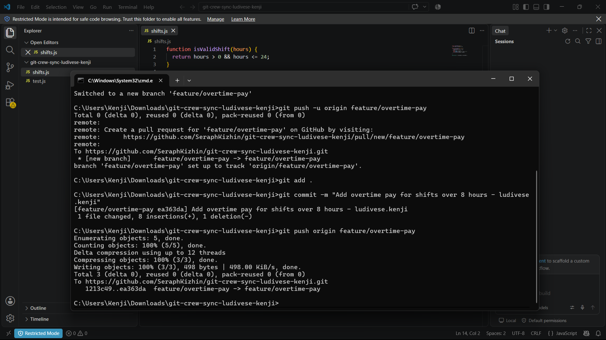
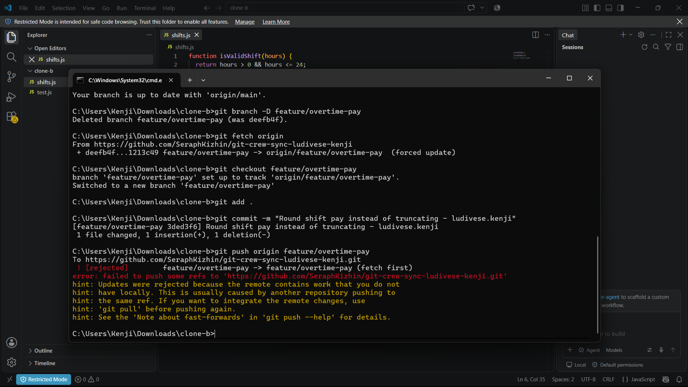
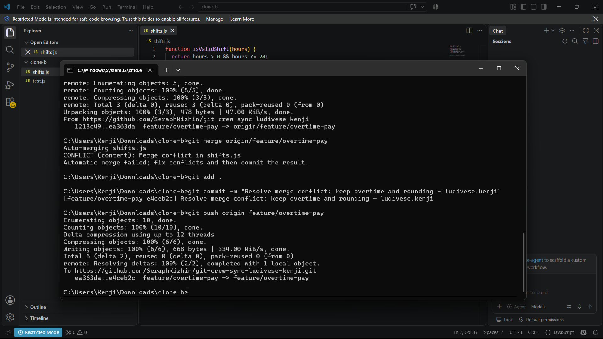
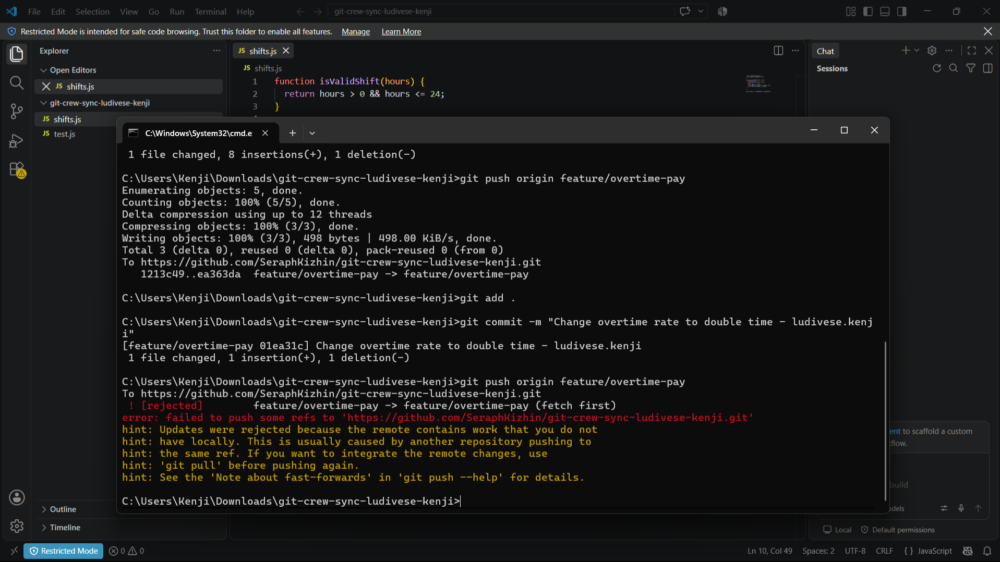
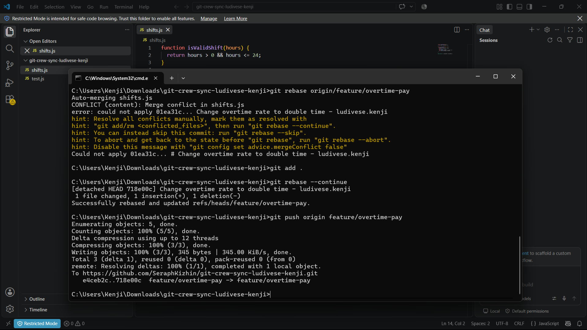
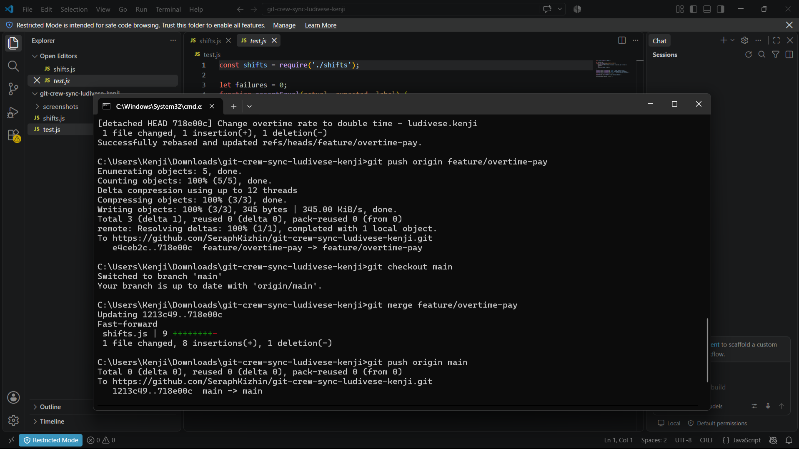
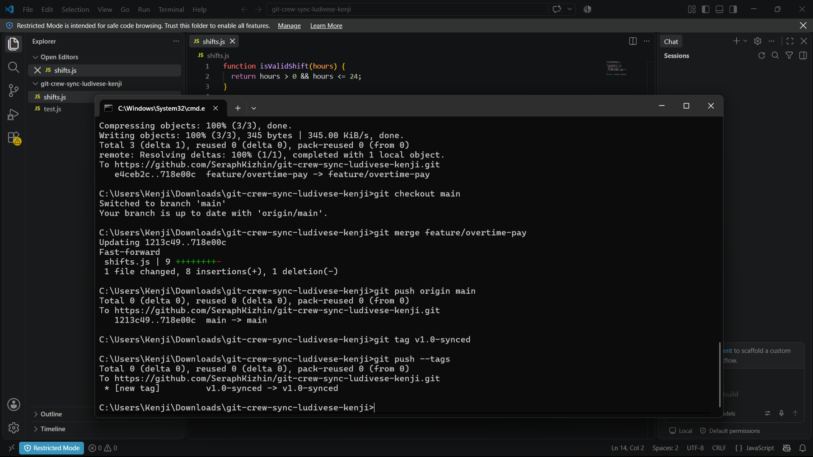
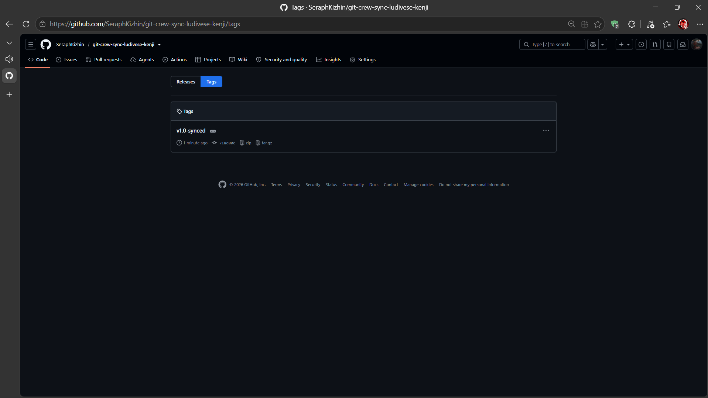

## Task Evidence

**Task 1**

**Task 2**

**Task 3**

**Task 4**

**Task 5**

**Task 6**

---

## Questions

**1. What did the rejected push error message tell you, and why did it happen?**
It told me that the remote repository contained work that I did not have locally. It happened because another developer (my other clone) pushed a commit to the shared branch while I was working, making my local history out-of-sync with the cloud.

**2. What's the actual difference between how you resolved Task 3 (merge) vs Task 4 (rebase)?**
The merge created a brand new merge commit that tied the two divergent histories together, preserving the exact chronological order of everyone's commits. The rebase temporarily set my local commit aside, downloaded my teammate's commits, and then replayed my commit on top of theirs, creating a clean, straight-line history without a merge commit.

**3. What one habit would have avoided both rejected pushes in this lab?**
Running git pull or git fetch + git merge/rebase right before I start working, and ideally again right before I try to push.

**4. Which approach - merge or rebase - would you default to on a shared team branch, and why?**
On a shared branch where multiple people are actively pushing code like main or a shared feature branch, merge is generally safer because it doesn't rewrite commit history. Rebasing rewrites history, which can cause massive headaches for teammates who have already based their work on the old history.